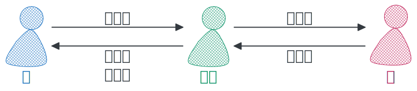

## あげる・もらう・くれる

- 「あげる」：我给别人，别人给别人
- 「もらう」：我收到，别人收到
- 「くれる」：别人给我



```
# 我和太郎（名词）
1. 私は太郎に果物をあげた（我给了太郎水果）
2. 私は太郎に果物をもらった（我收到了太郎的水果）
3. 太郎は私に果物をくれた（太郎给了我水果）

# 我和太郎（动词）
1. 私は太郎を手伝ってあげた（我给了太郎帮助）
2. 私は太郎に手伝ってもらった（我收到了太郎的帮助）
3. 太郎は私を手伝ってくれた（太郎给了我帮助）

# 太郎和樱（名词）
1. 太郎は桜に果物をあげた（太郎给了樱水果）
2. 桜は太郎に果物をもらった（樱收到了太郎给的水果）

# 太郎和樱（动词）
1. 太郎は桜を手伝ってあげた（太郎给了樱帮助）
2. 桜は太郎に手伝ってもらった（樱收到了太郎给的帮助）

# 我和猫
1. 私は猫に餌をやる（我给猫喂饲料）
2. 私は花に水をやる（我给花浇水）
```

> [!TIP]
>
> - 「我」：泛指我方（我，我弟弟）
>   - 太郎は弟に果物をあげた（太郎给了我弟弟水果）
> - 「别人」：泛指对方

## もらえない・くれない

- 「もらえない」：主语是自己，更加礼貌
- 「くれない」：主语是别人

```
1. あなたは私にお金を貸してくれない？（你能借我钱吗？）
   私はあなたからお金を貸してもらえない？（我能从你那借钱吗？）
2. 時間を教えてもらえますか。（能请你告诉我时间吗？）
   時間を教えてくれますか。（你能告诉我时间吗？）
```
